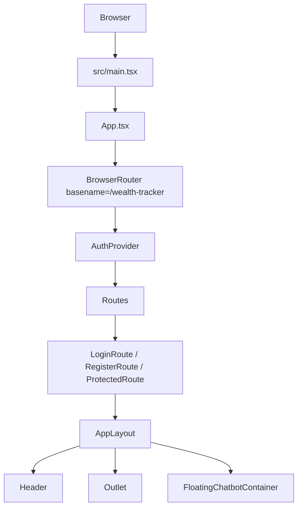
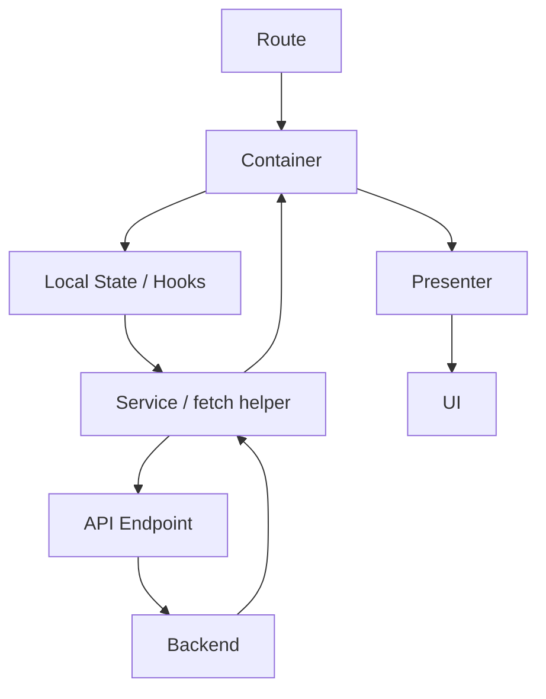
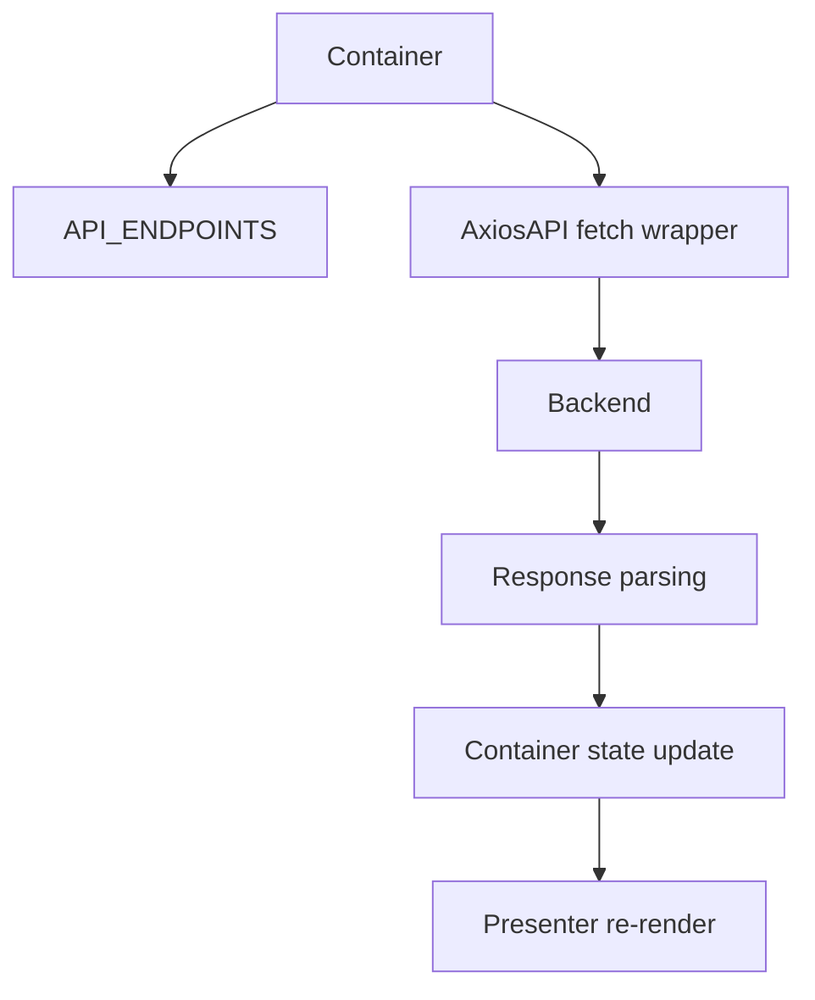
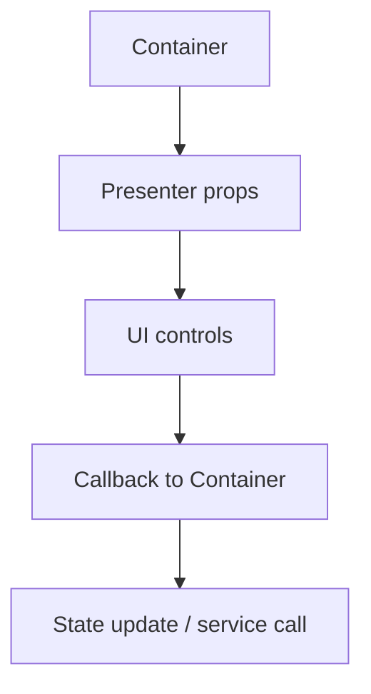
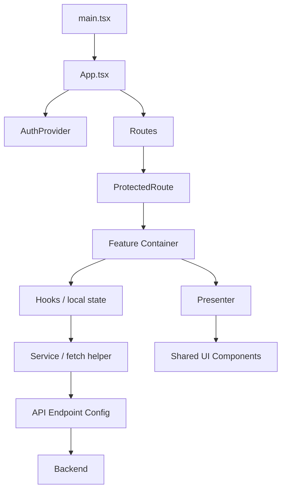

# WealthTracker Module Wise Flow Document

## 1. Executive Summary

This React app is built with a clear route-driven feature structure and a practical Container-Presenter pattern for most user-facing modules.

Key findings:

- `src/main.tsx` bootstraps the React tree and renders `App.tsx`.
- `src/App.tsx` owns routing, auth gating, layout composition, and the floating chatbot.
- Authentication is implemented with a local React context in `src/features/login/context/*`, backed by `localStorage` and JWT expiry checks.
- API calls are not centralized in Axios; the repo uses a custom `fetch` wrapper in `src/serviceconfigs/AxiosAPI.ts`.
- State management is primarily local component state plus React context. No Redux, Zustand, or TanStack Query was found.
- The app has several major routed modules: login, register, dashboard, expense details, expense categories, checklist categories, checklists, website categories, website links, expense reports, service health dashboard, and metrics.
- Some folders named `AuthProvider.tsx` inside feature folders are empty placeholders and do not participate in runtime flow.

## 2. Project Structure

### Actual Major Folders

```text
src/
  App.tsx
  main.tsx
  context/
  routes/
  serviceconfigs/
  utils/
  components/
  features/
  assets/
```

### Responsibility Summary

- `src/App.tsx`: application shell, router, auth provider, layout, protected routes.
- `src/context/`: shared app context, currently navigation context.
- `src/routes/`: route constants and route guard.
- `src/serviceconfigs/`: API endpoint definitions and low-level fetch helpers.
- `src/utils/`: shared utilities like JWT decoding and URL helpers.
- `src/components/`: shared UI chrome such as `Header`.
- `src/features/`: all feature modules, each with its own container/presenter/types/services/styles structure.

## 3. App.tsx Flow

### File

- [`src/App.tsx`](src/App.tsx)

### What It Does

`App.tsx` is the top-level application composition point. It:

- wraps the app with `BrowserRouter`
- provides authentication state through `AuthProvider`
- defines public and protected routes
- composes the authenticated layout
- initializes app navigation context
- renders the global `Header`
- renders the floating chatbot for authenticated screens

### Root Components Rendered

- `BrowserRouter`
- `AuthProvider`
- `Routes`
- `LoginRoute`
- `RegisterRoute`
- `ProtectedRoute`
- `AppLayout`
- `Header`
- `Outlet`
- `FloatingChatbotContainer`

### Execution Flow

```text
main.tsx
  ↓
App.tsx
  ↓
BrowserRouter
  ↓
AuthProvider
  ↓
Routes
  ↓
Public route or ProtectedRoute
  ↓
AppLayout
  ↓
Header + Outlet + FloatingChatbotContainer
  ↓
Feature Container
  ↓
Presenter
```

### Important Behavior

- `BrowserRouter` uses `basename="/wealth-tracker"`.
- `LoginRoute` redirects authenticated users away from `/login`.
- `RegisterRoute` redirects authenticated users away from `/register`.
- `ProtectedRoute` blocks all authenticated feature routes until auth is hydrated and valid.
- `AppLayout` computes `currentScreen` from the current location and exposes navigation helpers through `AppNavigationContext`.
- Logout is handled in `AppLayout` via `useAuth().logout()` and then redirects to `/login`.

### Application-Level Hooks

- `useLocation` and `useNavigate` from React Router
- `useMemo` for screen derivation
- `useAuth` for authentication state

## 4. Application Startup Flow

### Entry Point

- [`src/main.tsx`](src/main.tsx)

### Startup Sequence

```text
Browser
  ↓
src/main.tsx
  ↓
createRoot(...)
  ↓
<StrictMode>
  ↓
<App />
  ↓
Router initialization
  ↓
AuthProvider initialization
  ↓
Route resolution
  ↓
Login / Register / Protected module
```

### Notes

- No separate `index.tsx` exists in this repo.
- `main.tsx` imports `./index.css` globally before rendering the app.
- Environment config is consumed indirectly through `src/serviceconfigs/ApiEndpoints.ts`.

## 5. Authentication Configuration

### Files

- [`src/features/login/context/AuthProvider.tsx`](src/features/login/context/AuthProvider.tsx)
- [`src/features/login/context/AuthContext.ts`](src/features/login/context/AuthContext.ts)
- [`src/features/login/context/useAuth.ts`](src/features/login/context/useAuth.ts)
- [`src/features/login/context/authStorage.ts`](src/features/login/context/authStorage.ts)
- [`src/features/login/context/authSession.ts`](src/features/login/context/authSession.ts)
- [`src/features/login/service/authService.ts`](src/features/login/service/authService.ts)
- [`src/routes/ProtectedRoute.tsx`](src/routes/ProtectedRoute.tsx)
- [`src/features/login/container/LoginContainer.tsx`](src/features/login/container/LoginContainer.tsx)
- [`src/features/Register/RegisterContainer.tsx`](src/features/Register/RegisterContainer.tsx)

### Auth Model

Auth state is stored in a React context as an `AuthPayload`/`AuthState` shape containing:

- `accessToken`
- `refreshToken`
- `tokenType`
- `username`
- derived booleans like `isAuthenticated`

### Storage

- Auth data is persisted in `localStorage` under `wealth_tracker_auth`.
- The last visited screen is stored in `sessionStorage` under `wealth_tracker_last_screen`, but only the storage helper exists here. There is no direct usage in the inspected runtime flow beyond the constant definition.

### Token Validation

- `authSession.ts` decodes the JWT and checks `exp` if present.
- If the token is expired, auth state is cleared.

### Login Flow

```text
LoginContainer
  ↓
postRequest(API_ENDPOINTS.auth.login)
  ↓
LoginResponse
  ↓
AuthProvider.login(response, username)
  ↓
localStorage write
  ↓
Navigate to dashboard or original route
```

### Logout Flow

```text
AppLayout.handleLogout
  ↓
useAuth().logout()
  ↓
clear local auth state
  ↓
clear localStorage + sessionStorage
  ↓
logoutRequest(refreshToken)
  ↓
API logout endpoint
  ↓
navigate('/login')
```

### Protected Route Flow

```text
ProtectedRoute
  ↓
isHydrated?
  ↓
isAuthenticated?
  ↓
Outlet or redirect to /login
```

### Interceptors / Headers

- There is no Axios interceptor layer.
- The project uses the shared `fetch` wrapper in `src/serviceconfigs/AxiosAPI.ts`.
- Feature containers manually build `Authorization` headers with `Bearer <accessToken>` or the token type from auth state.
- Logout uses `X-Refresh-Token` in the request headers.

### Third-Party Auth

- No third-party auth SDK was found.
- Authentication is custom, server-backed, and JWT-based.

## 6. Routing Architecture

### File

- [`src/routes/routePaths.ts`](src/routes/routePaths.ts)
- [`src/routes/ProtectedRoute.tsx`](src/routes/ProtectedRoute.tsx)

### Route Table

| Route | Module | Container | Presenter | Auth Required | Main Purpose |
| --- | --- | --- | --- | --- | --- |
| `/login` | Login | `LoginContainer` | `LoginPresenter` | No | Sign in |
| `/register` | Register | `RegisterContainer` | `Register` / `RegisterPresenter` | No | Create account |
| `/` | Dashboard | `DashboardContainer` | `DashboardPresenter` | Yes | Expense overview |
| `/expense-details` | Expense Details | `ExpenseDetailsContainer` | `ExpenseDetailsPresenter` | Yes | Manage expense records |
| `/expense-categories` | Expense Categories | `ExpenseCategoryContainer` | `ExpenseCategoryPresenter` | Yes | Manage categories |
| `/checklist-categories` | Checklist Categories | `ChecklistCategoryContainer` | `ChecklistCategoryPresenter` | Yes | Manage checklist categories |
| `/checklists` | Checklists | `ChecklistContainer` | `ChecklistPresenter` | Yes | Manage checklist items |
| `/website-categories` | Website Categories | `WebsiteCategoryContainer` | `WebsiteCategoryPresenter` | Yes | Manage website categories |
| `/website-links` | Website Links | `WebsiteLinkContainer` | `WebsiteLinkPresenter` | Yes | Manage website links |
| `/expense-reports` | Expense Reports | `ExpenseReportContainer` | `ExpenseReportPresenter` | Yes | Generate reports and PDFs |
| `/service-health` | Service Health Dashboard | `ServiceHealthDashboardContainer` | `ServiceHealthDashboardPresenter` | Yes | View service health |
| `/metrics` | Metrics | `MetricsContainer` | `MetricsPresenter` | Yes | View operational metrics |

### Public Routes

- `/login`
- `/register`
- `/` redirect
- `*` redirect to `/login`

### Protected Routes

All feature routes inside `ProtectedRoute`.

### Redirects

- `/` redirects to dashboard route by route definition.
- `*` redirects to `/login`.
- Authenticated users on `/login` and `/register` are redirected to `/`.

## 7. Module / Feature Mapping

### Major Routed Modules

1. Login
2. Register
3. Dashboard
4. Expense Details
5. Expense Categories
6. Checklist Categories
7. Checklists
8. Website Categories
9. Website Links
10. Expense Reports
11. Service Health Dashboard
12. Metrics

### Non-Routed Shared Modules

- `Header`
- `Sidebar`
- `FloatingChatbotContainer`
- `ChatbotContainer`
- `AppNavigationContext`
- `serviceconfigs/*`
- `utils/*`

### Module Notes

- Most feature modules follow the same pattern: container owns logic, presenter owns UI.
- `DashboardContainer` is a good example of view-model assembly and data fetching.
- `ExpenseReportContainer`, `WebsiteLinkContainer`, and `ExpenseCategoryContainer` are fuller CRUD-style containers.
- `MetricsContainer` and `ServiceHealthDashboardContainer` are operational dashboards with polling and transformation logic.

## 8. Container-Presenter Architecture

### Container Responsibilities Observed

Containers in this repo typically handle:

- API calls
- auth checks and redirects
- local state
- loading and error states
- form state
- data transformation
- filtering, sorting, pagination
- navigation after success

### Presenter Responsibilities Observed

Presenters typically handle:

- layout and visual composition
- rendering forms, tables, cards, and empty states
- invoking callbacks from props
- formatting for display

### Pattern Quality

The pattern is mostly followed well. The biggest deviation is that some presenters contain small formatting helpers, which is acceptable and still presentation-oriented.

### Deviation Observations

- The feature module named `Register` uses an extra wrapper layer: `RegisterContainer` renders `Register`, which then likely renders `RegisterPresenter`. This is more layered than the other features.
- Some empty `context/AuthProvider.tsx` files exist in feature folders, but they are not part of the live architecture.
- `MetricsContainer` and `ServiceHealthDashboardContainer` contain a lot of domain logic, but they still keep direct API access out of presenters.

## 9. State Management

### Approach Used

- React local state via `useState`
- React context via `AuthContext` and `AppNavigationContext`
- No Redux
- No Redux Toolkit
- No Zustand
- No TanStack Query / React Query

### State Classification

- Global state: auth session in `AuthContext`
- App shell state: current screen in `AppNavigationContext`
- Module state: lists, forms, filters, pagination, loading, errors in each container
- UI state: toggles like password visibility, modal/panel expansion, auto refresh
- Server state: fetched API responses stored in container state

### Example State Flow

```text
Container
  ↓
useState / useEffect
  ↓
service call
  ↓
setState(...)
  ↓
Presenter re-render
```

## 10. API / Service Architecture

### API Layer

- [`src/serviceconfigs/AxiosAPI.ts`](src/serviceconfigs/AxiosAPI.ts)
- [`src/serviceconfigs/ApiEndpoints.ts`](src/serviceconfigs/ApiEndpoints.ts)

### What It Actually Is

Despite the file name `AxiosAPI.ts`, the app uses the browser `fetch` API.

### Shared Request Helpers

- `getRequest`
- `postRequest`
- `putRequest`
- `deleteRequest`

### Error Handling

- Parses JSON or text responses.
- Converts failed responses into thrown `Error` objects with optional `status`.
- Emits a session timeout callback on `401`.

### Base URLs

Environment variables with local fallbacks:

- `VITE_AUTH_BASE_URL` default `http://localhost:8085`
- `VITE_EXPENSE_BASE_URL` default `http://localhost:8086`
- `VITE_REPORT_AUTOMATION_BASE_URL` default `http://localhost:8089`

### Service Mapping

| Module | Service | Method | Endpoint | Request | Response |
| --- | --- | --- | --- | --- | --- |
| Login | auth | `POST` | `API_ENDPOINTS.auth.login` | `LoginRequest` | `LoginResponse` |
| Register | auth | `POST` | `API_ENDPOINTS.auth.register` | `RegisterRequest` | `RegisterResponse` |
| Logout | auth | `POST` | `API_ENDPOINTS.auth.logout` | empty body + `X-Refresh-Token` | no body expected |
| Expense Categories | expense | `GET/POST/PUT/DELETE` | `API_ENDPOINTS.expense.categories`, `categoryById` | category payloads | category models |
| Expense Details | expense | `GET/POST/PUT/DELETE` | `API_ENDPOINTS.expense.details`, `detailById` | detail payloads | detail models |
| Expense Reports | expense / report automation | `GET/POST` | `API_ENDPOINTS.expense.summary`, `trends`, `reportDetails`, `reportPdf`, `sendExpenseDetailsEmail` | report filters/email payloads | summary, trend, PDF, email response |
| Website Categories | expense | `GET/POST/PUT/DELETE` | `API_ENDPOINTS.website.categories`, `categoryById` | website category payloads | category models |
| Website Links | expense | `GET/POST/PUT/DELETE` | `API_ENDPOINTS.website.links`, `linkById` | website link payloads | link models |
| Checklist Categories | expense | `GET/POST/PUT/DELETE` | `API_ENDPOINTS.checklist.categories`, `categoryById` | checklist category payloads | checklist category models |
| Checklists | expense | `GET/POST/PUT/DELETE` | `API_ENDPOINTS.checklist.items`, `itemById` | checklist payloads | checklist models |
| Metrics | actuator | `GET` | `API_ENDPOINTS.actuator.*` | auth header only | actuator / prometheus responses |
| Service Health | actuator | `GET` | `API_ENDPOINTS.actuator.*` | none or auth header depending on service | health/info/metrics text |

## 11. Configuration Architecture

### Config Files

- [`src/serviceconfigs/ApiEndpoints.ts`](src/serviceconfigs/ApiEndpoints.ts)
- [`src/routes/routePaths.ts`](src/routes/routePaths.ts)
- [`src/context/AppNavigationContext.tsx`](src/context/AppNavigationContext.tsx)
- [`src/App.tsx`](src/App.tsx)

### Flow

```text
Environment
  ↓
ApiEndpoints.ts
  ↓
Containers / Services
  ↓
API requests
```

### Runtime Configuration Found

- API base URLs via Vite env variables
- Router basename via `BrowserRouter`
- Screen mapping via `routePaths.ts`
- App navigation screen mapping via `AppNavigationContext`

### Not Found

- No theme provider
- No localization provider
- No feature flag system
- No runtime config loader

## 12. Module Wise Detailed Flows

### 12.1 Login

**Files**

- [`src/features/login/container/LoginContainer.tsx`](src/features/login/container/LoginContainer.tsx)
- [`src/features/login/presenter/LoginPresenter.tsx`](src/features/login/presenter/LoginPresenter.tsx)
- [`src/features/login/service/authService.ts`](src/features/login/service/authService.ts)

**Flow**

```text
/login
  ↓
LoginRoute
  ↓
LoginContainer
  ↓
LoginPresenter
  ↓
user submits credentials
  ↓
postRequest(login endpoint)
  ↓
login response
  ↓
AuthContext.login(...)
  ↓
localStorage update
  ↓
navigate to dashboard or original route
```

**Notes**

- Error messages are shown locally in the presenter.
- No token refresh flow is implemented here.

### 12.2 Register

**Files**

- [`src/features/Register/RegisterContainer.tsx`](src/features/Register/RegisterContainer.tsx)
- [`src/features/Register/Register.tsx`](src/features/Register/Register.tsx)
- [`src/features/Register/presenter/RegisterPresenter.tsx`](src/features/Register/presenter/RegisterPresenter.tsx)
- [`src/features/Register/validation.ts`](src/features/Register/validation.ts)
- [`src/features/Register/RegisterService.ts`](src/features/Register/RegisterService.ts)

**Flow**

```text
/register
  ↓
RegisterRoute
  ↓
RegisterContainer
  ↓
validation
  ↓
registerRequest
  ↓
AuthContext.login(...)
  ↓
success message
  ↓
delayed navigate to dashboard
```

### 12.3 Dashboard

**Files**

- [`src/features/dashboard/container/DashboardContainer.tsx`](src/features/dashboard/container/DashboardContainer.tsx)
- [`src/features/dashboard/presenter/DashboardPresenter.tsx`](src/features/dashboard/presenter/DashboardPresenter.tsx)
- [`src/features/dashboard/view/ExpenseChart.tsx`](src/features/dashboard/view/ExpenseChart.tsx)

**Flow**

```text
/ 
  ↓
ProtectedRoute
  ↓
DashboardContainer
  ↓
decode userId from JWT
  ↓
fetch summary + trends
  ↓
DashboardPresenter
  ↓
ExpenseChart
```

### 12.4 Expense Categories

**Files**

- [`src/features/ExpenseCategory/container/ExpenseCategoryContainer.tsx`](src/features/ExpenseCategory/container/ExpenseCategoryContainer.tsx)
- [`src/features/ExpenseCategory/presenter/ExpenseCategoryPresenter.tsx`](src/features/ExpenseCategory/presenter/ExpenseCategoryPresenter.tsx)

**Flow**

```text
Route
  ↓
ExpenseCategoryContainer
  ↓
load categories
  ↓
create/update/delete category
  ↓
refresh list
  ↓
ExpenseCategoryPresenter
```

### 12.5 Expense Details

**Files**

- [`src/features/ExpenseDetails/container/ExpenseDetailsContainer.tsx`](src/features/ExpenseDetails/container/ExpenseDetailsContainer.tsx)
- [`src/features/ExpenseDetails/presenter/ExpenseDetailsPresenter.tsx`](src/features/ExpenseDetails/presenter/ExpenseDetailsPresenter.tsx)

**Flow**

```text
Route
  ↓
ExpenseDetailsContainer
  ↓
load details + categories
  ↓
create/update/delete expense detail
  ↓
refresh list
  ↓
ExpenseDetailsPresenter
```

### 12.6 Checklist Categories

**Files**

- [`src/features/ChecklistCategory/container/ChecklistCategoryContainer.tsx`](src/features/ChecklistCategory/container/ChecklistCategoryContainer.tsx)
- [`src/features/ChecklistCategory/presenter/ChecklistCategoryPresenter.tsx`](src/features/ChecklistCategory/presenter/ChecklistCategoryPresenter.tsx)

### 12.7 Checklists

**Files**

- [`src/features/Checklist/container/ChecklistContainer.tsx`](src/features/Checklist/container/ChecklistContainer.tsx)
- [`src/features/Checklist/presenter/ChecklistPresenter.tsx`](src/features/Checklist/presenter/ChecklistPresenter.tsx)

### 12.8 Website Categories

**Files**

- [`src/features/WebsiteCategory/container/WebsiteCategoryContainer.tsx`](src/features/WebsiteCategory/container/WebsiteCategoryContainer.tsx)
- [`src/features/WebsiteCategory/presenter/WebsiteCategoryPresenter.tsx`](src/features/WebsiteCategory/presenter/WebsiteCategoryPresenter.tsx)

### 12.9 Website Links

**Files**

- [`src/features/WebsiteLink/container/WebsiteLinkContainer.tsx`](src/features/WebsiteLink/container/WebsiteLinkContainer.tsx)
- [`src/features/WebsiteLink/presenter/WebsiteLinkPresenter.tsx`](src/features/WebsiteLink/presenter/WebsiteLinkPresenter.tsx)

### 12.10 Expense Reports

**Files**

- [`src/features/ExpenseReport/container/ExpenseReportContainer.tsx`](src/features/ExpenseReport/container/ExpenseReportContainer.tsx)
- [`src/features/ExpenseReport/presenter/ExpenseReportPresenter.tsx`](src/features/ExpenseReport/presenter/ExpenseReportPresenter.tsx)
- [`src/features/ExpenseReport/service/expenseReportService.ts`](src/features/ExpenseReport/service/expenseReportService.ts)

**Notable Behavior**

- Uses date filtering, sorting, paging, PDF generation, and email sending.
- Builds `userId` from the JWT.
- Validates date range locally before API calls.

### 12.11 Service Health Dashboard

**Files**

- [`src/features/ServiceHealthDashboard/container/ServiceHealthDashboardContainer.tsx`](src/features/ServiceHealthDashboard/container/ServiceHealthDashboardContainer.tsx)
- [`src/features/ServiceHealthDashboard/presenter/ServiceHealthDashboardPresenter.tsx`](src/features/ServiceHealthDashboard/presenter/ServiceHealthDashboardPresenter.tsx)
- [`src/features/ServiceHealthDashboard/services/serviceHealthApi.ts`](src/features/ServiceHealthDashboard/services/serviceHealthApi.ts)

**Notable Behavior**

- Periodic polling every 30 seconds.
- Expands individual services to load details on demand.
- Calls health, info, actuator metrics, and Prometheus endpoints.

### 12.12 Metrics

**Files**

- [`src/features/Metrics/container/MetricsContainer.tsx`](src/features/Metrics/container/MetricsContainer.tsx)
- [`src/features/Metrics/presenter/MetricsPresenter.tsx`](src/features/Metrics/presenter/MetricsPresenter.tsx)
- [`src/features/Metrics/services/MetricsApi.ts`](src/features/Metrics/services/MetricsApi.ts)
- [`src/features/Metrics/components/*`](src/features/Metrics/components)

**Notable Behavior**

- Uses Prometheus text scraping.
- Parses metrics in the container and derives summaries and series state.
- Checks JWT roles for admin visibility, but falls back to usable access if roles are missing.

### 12.13 Chatbot

**Files**

- [`src/features/chatbot/container/FloatingChatbotContainer.tsx`](src/features/chatbot/container/FloatingChatbotContainer.tsx)
- [`src/features/chatbot/container/ChatbotContainer.tsx`](src/features/chatbot/container/ChatbotContainer.tsx)
- [`src/features/chatbot/presenter/ChatbotPresenter.tsx`](src/features/chatbot/presenter/ChatbotPresenter.tsx)
- [`src/features/chatbot/view/ChatbotView.tsx`](src/features/chatbot/view/ChatbotView.tsx)

**Notes**

- Rendered globally from `AppLayout`.
- Only shown when `isAuthenticated` is true.
- Uses auth context and app navigation context.

## 13. Authentication + API Flow

```text
User
  ↓
Login Page
  ↓
LoginContainer
  ↓
auth API via fetch wrapper
  ↓
JWT response
  ↓
AuthProvider stores session
  ↓
ProtectedRoute allows feature access
  ↓
Feature Container builds Authorization header
  ↓
fetch wrapper
  ↓
Backend API
```

### Important Detail

Because the request helpers do not automatically inject auth headers, the feature containers explicitly build the `Authorization` header from `useAuth()`.

## 14. Error / Loading Flow

### Loading Handling

- Containers use `isLoading` flags for lists, form submissions, PDF generation, email sending, and polling refreshes.
- Presenters render loading labels or disabled buttons based on those flags.

### Error Handling

- API errors are caught in containers and surfaced as `errorMessage`.
- `AxiosAPI.ts` normalizes failed responses into thrown `Error` objects.
- Service health utilities convert some failures into degraded statuses instead of throwing.

### Auth Errors

- `401` from the shared request helper triggers the session timeout callback.
- Auth context clears local session state on timeout.
- Protected routes then redirect to `/login` on the next render.

### Other Common Cases

- `403`: not specially handled in a shared way; would surface as request failure text unless the backend returns a meaningful message.
- `404`: surfaces as request failure or backend message.
- `500`: surfaces as request failure or backend message.
- Validation errors: handled locally in forms, especially register and expense report.
- Empty states: handled in presenters with explicit "no data" UI.
- Network failures: caught by containers and displayed as fallback error text.

## 15. Navigation Flow

### Declarative Navigation

- `Link` in the login presenter for register navigation.
- Router path definitions in `routePaths.ts`.

### Programmatic Navigation

- `navigate(from ?? ROUTES.dashboard, { replace: true })` after login.
- `navigate(ROUTES.dashboard, { replace: true })` after register success.
- `navigate(ROUTES.login, { replace: true })` after logout.
- Several containers redirect to login when `accessToken` is missing.

### App Navigation Context

- `AppNavigationContext` maps screen names to routes.
- Containers like dashboard, expense reports, service health, and metrics use `navigateTo('login')` when auth is absent.

## 16. Dependency Flow

### Common Flow

```text
Route
  ↓
Container
  ↓
Hook / local state
  ↓
Service / fetch helper
  ↓
API endpoint config
  ↓
Backend
```

### UI Flow

```text
Container
  ↓
Presenter
  ↓
Shared components / feature components
```

### Important Imports

- Containers import `useAuth` from `src/features/login/context/useAuth.ts`.
- Many containers import `API_ENDPOINTS` and request helpers from `src/serviceconfigs/*`.
- Dashboard, expense categories, expense details, report, website, checklist, metrics, and service health all use this pattern.

## 17. Architecture Observations

### Good Practices

- Clear route-to-module mapping.
- Container-Presenter separation is consistently used in most major features.
- Auth is centralized in one context instead of being duplicated across modules.
- API endpoint constants are grouped in one file.
- Shared request helpers avoid copy-pasted `fetch` code.
- The app uses route guards for protected modules.

### Architectural Issues

- `src/serviceconfigs/AxiosAPI.ts` is named like Axios but uses `fetch`, which is misleading.
- Feature containers manually build auth headers, so auth/header concerns are duplicated.
- Some empty `AuthProvider.tsx` files exist in feature folders, which adds noise.
- There is no shared error normalization layer beyond the fetch helper.
- The app does not have a dedicated server-state library, so some features do repeated fetching and state coordination manually.
- Some containers are fairly large and mix fetching, transformation, paging, and navigation.

### Improvement Suggestions

**P0 - Critical**

- None identified from the inspected code.

**P1 - High**

- Rename `AxiosAPI.ts` to something like `requestClient.ts` or `fetchClient.ts`.
- Add a small helper to build auth headers from `useAuth()` so features do not duplicate the logic.
- Remove or consolidate empty placeholder `AuthProvider.tsx` files.

**P2 - Medium**

- Extract common container behaviors like `isLoading` / `errorMessage` handling into shared hooks where useful.
- Add a thin auth-aware request helper for authenticated services.
- Split very large containers into smaller domain hooks if growth continues.

**P3 - Optional**

- Consider a query/cache layer only if server-state complexity increases further.
- Add a dedicated design-system folder for shared buttons, cards, and table patterns if duplication grows.

## 18. Recommended Target Architecture

The current structure already supports the Container-Presenter pattern well. A realistic target architecture would keep the same direction but reduce duplication.

```text
src/
  app/
    App.tsx
    providers/
    config/

  auth/
    context/
    hooks/
    services/
    guards/

  routes/
    routePaths.ts
    ProtectedRoute.tsx

  shared/
    components/
    hooks/
    utils/
    services/

  features/
    login/
      container/
      presenter/
      service/
      types/
      context/
    dashboard/
      container/
      presenter/
      view/
      types/
    expense-categories/
      container/
      presenter/
      types/
    ...
```

### Why This Fits This Repo

- Keeps the current route-driven feature layout.
- Preserves containers as orchestration points.
- Keeps presenters purely presentational.
- Gives auth and API concerns a clearer home.

## 19. Mermaid Diagrams

### Application Startup



### Authentication Flow

```mermaid
flowchart TD
  A[LoginContainer / RegisterContainer] --> B[postRequest to auth API]
  B --> C[JWT Response]
  C --> D[AuthProvider.login]
  D --> E[localStorage]
  E --> F[useAuth()]
  F --> G[ProtectedRoute]
```

### Module Flow



### API Flow



### Container-Presenter Flow



### Overall Architecture



## 20. Architecture at a Glance

```text
src/main.tsx
  ↓
src/App.tsx
  ↓
BrowserRouter
  ↓
src/features/login/context/AuthProvider.tsx
  ↓
Routes
  ↓
ProtectedRoute or LoginRoute/RegisterRoute
  ↓
Feature Container
  ↓
useState / useEffect / useMemo / useCallback
  ↓
src/serviceconfigs/AxiosAPI.ts
  ↓
src/serviceconfigs/ApiEndpoints.ts
  ↓
Backend services
  ↓
Container state update
  ↓
Presenter
  ↓
Shared UI / feature components
```

## 21. File Reference Index

- [`src/main.tsx`](src/main.tsx)
- [`src/App.tsx`](src/App.tsx)
- [`src/routes/routePaths.ts`](src/routes/routePaths.ts)
- [`src/routes/ProtectedRoute.tsx`](src/routes/ProtectedRoute.tsx)
- [`src/context/AppNavigationContext.tsx`](src/context/AppNavigationContext.tsx)
- [`src/serviceconfigs/AxiosAPI.ts`](src/serviceconfigs/AxiosAPI.ts)
- [`src/serviceconfigs/ApiEndpoints.ts`](src/serviceconfigs/ApiEndpoints.ts)
- [`src/utils/jwt.ts`](src/utils/jwt.ts)
- [`src/components/Header.tsx`](src/components/Header.tsx)
- [`src/components/Sidebar.tsx`](src/components/Sidebar.tsx)
- [`src/features/login/context/AuthProvider.tsx`](src/features/login/context/AuthProvider.tsx)
- [`src/features/login/context/AuthContext.ts`](src/features/login/context/AuthContext.ts)
- [`src/features/login/context/useAuth.ts`](src/features/login/context/useAuth.ts)
- [`src/features/login/context/authStorage.ts`](src/features/login/context/authStorage.ts)
- [`src/features/login/context/authSession.ts`](src/features/login/context/authSession.ts)
- [`src/features/login/container/LoginContainer.tsx`](src/features/login/container/LoginContainer.tsx)
- [`src/features/login/presenter/LoginPresenter.tsx`](src/features/login/presenter/LoginPresenter.tsx)
- [`src/features/login/service/authService.ts`](src/features/login/service/authService.ts)
- [`src/features/Register/RegisterContainer.tsx`](src/features/Register/RegisterContainer.tsx)
- [`src/features/Register/Register.tsx`](src/features/Register/Register.tsx)
- [`src/features/Register/presenter/RegisterPresenter.tsx`](src/features/Register/presenter/RegisterPresenter.tsx)
- [`src/features/Register/validation.ts`](src/features/Register/validation.ts)
- [`src/features/Register/RegisterService.ts`](src/features/Register/RegisterService.ts)
- [`src/features/dashboard/container/DashboardContainer.tsx`](src/features/dashboard/container/DashboardContainer.tsx)
- [`src/features/dashboard/presenter/DashboardPresenter.tsx`](src/features/dashboard/presenter/DashboardPresenter.tsx)
- [`src/features/ExpenseCategory/container/ExpenseCategoryContainer.tsx`](src/features/ExpenseCategory/container/ExpenseCategoryContainer.tsx)
- [`src/features/ExpenseCategory/presenter/ExpenseCategoryPresenter.tsx`](src/features/ExpenseCategory/presenter/ExpenseCategoryPresenter.tsx)
- [`src/features/ExpenseDetails/container/ExpenseDetailsContainer.tsx`](src/features/ExpenseDetails/container/ExpenseDetailsContainer.tsx)
- [`src/features/ExpenseDetails/presenter/ExpenseDetailsPresenter.tsx`](src/features/ExpenseDetails/presenter/ExpenseDetailsPresenter.tsx)
- [`src/features/ExpenseReport/container/ExpenseReportContainer.tsx`](src/features/ExpenseReport/container/ExpenseReportContainer.tsx)
- [`src/features/ExpenseReport/presenter/ExpenseReportPresenter.tsx`](src/features/ExpenseReport/presenter/ExpenseReportPresenter.tsx)
- [`src/features/ExpenseReport/service/expenseReportService.ts`](src/features/ExpenseReport/service/expenseReportService.ts)
- [`src/features/WebsiteCategory/container/WebsiteCategoryContainer.tsx`](src/features/WebsiteCategory/container/WebsiteCategoryContainer.tsx)
- [`src/features/WebsiteCategory/presenter/WebsiteCategoryPresenter.tsx`](src/features/WebsiteCategory/presenter/WebsiteCategoryPresenter.tsx)
- [`src/features/WebsiteLink/container/WebsiteLinkContainer.tsx`](src/features/WebsiteLink/container/WebsiteLinkContainer.tsx)
- [`src/features/WebsiteLink/presenter/WebsiteLinkPresenter.tsx`](src/features/WebsiteLink/presenter/WebsiteLinkPresenter.tsx)
- [`src/features/ChecklistCategory/container/ChecklistCategoryContainer.tsx`](src/features/ChecklistCategory/container/ChecklistCategoryContainer.tsx)
- [`src/features/ChecklistCategory/presenter/ChecklistCategoryPresenter.tsx`](src/features/ChecklistCategory/presenter/ChecklistCategoryPresenter.tsx)
- [`src/features/Checklist/container/ChecklistContainer.tsx`](src/features/Checklist/container/ChecklistContainer.tsx)
- [`src/features/Checklist/presenter/ChecklistPresenter.tsx`](src/features/Checklist/presenter/ChecklistPresenter.tsx)
- [`src/features/ServiceHealthDashboard/container/ServiceHealthDashboardContainer.tsx`](src/features/ServiceHealthDashboard/container/ServiceHealthDashboardContainer.tsx)
- [`src/features/ServiceHealthDashboard/presenter/ServiceHealthDashboardPresenter.tsx`](src/features/ServiceHealthDashboard/presenter/ServiceHealthDashboardPresenter.tsx)
- [`src/features/ServiceHealthDashboard/services/serviceHealthApi.ts`](src/features/ServiceHealthDashboard/services/serviceHealthApi.ts)
- [`src/features/Metrics/container/MetricsContainer.tsx`](src/features/Metrics/container/MetricsContainer.tsx)
- [`src/features/Metrics/presenter/MetricsPresenter.tsx`](src/features/Metrics/presenter/MetricsPresenter.tsx)
- [`src/features/Metrics/services/MetricsApi.ts`](src/features/Metrics/services/MetricsApi.ts)
- [`src/features/chatbot/container/FloatingChatbotContainer.tsx`](src/features/chatbot/container/FloatingChatbotContainer.tsx)
- [`src/features/chatbot/container/ChatbotContainer.tsx`](src/features/chatbot/container/ChatbotContainer.tsx)
- [`src/features/chatbot/presenter/ChatbotPresenter.tsx`](src/features/chatbot/presenter/ChatbotPresenter.tsx)
- [`src/features/chatbot/view/ChatbotView.tsx`](src/features/chatbot/view/ChatbotView.tsx)
